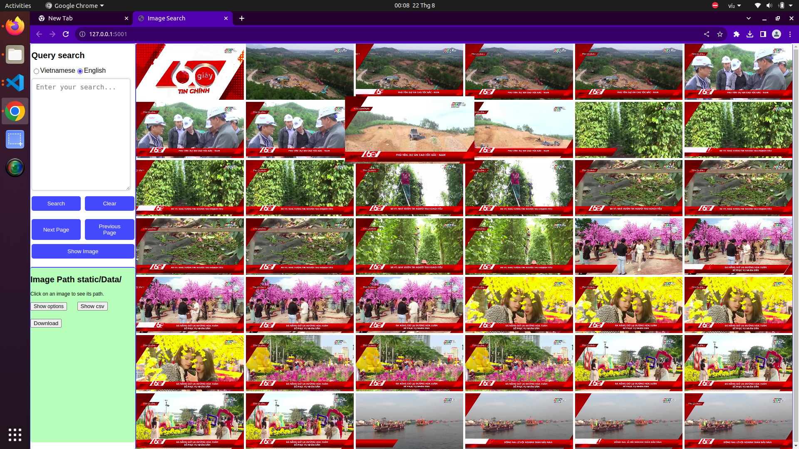

<h1><center>HCM AI CHALLENGE 2023 <br> Event Retrieval from Video</center></h1>

## Introduction
The contest was organized in collaboration with the Department of Information and Communications of Ho Chi Minh City. Ho Chi Minh City and National University of Ho Chi Minh City. Ho Chi Minh City, Department of Science and Technology, Informatics Association, City Youth Union. Ho Chi Minh City, Vietnam Association of Software and Information Technology Services (VINASA).

In this contest, the goal is to find the event video with known information. Specifically, for each query that provides a short excerpt or an image in advance, the goal is to find the video containing that information in the news video database of newspapers and television stations in Vietnam.

## Timeline: 
    31/07/2023: Thời gian đăng ký
    07-08/2023: Tổ chức tập huấn
    07/2023: Công bố nội dung, yêu cầu của vòng sơ tuyển
    16-18-20/09/2023: Thời gian diễn ra vòng sơ tuyển (30 ngày)
    08/10/2023: Thời gian diễn ra vòng chung kết
## SPK Sandbox Team
Mentor: [Đỗ Trần Nhật Tường](https://github.com/dotrannhattuong)

Leader: [Nguyễn Hoàng Anh Tuấn](https://github.com/aTunass) 
- [Trần Văn Hồ ](https://github.com/tranvanhospk)

- [Nguyễn Hương Quỳnh](https://github.com/nguyenhuongquynh2607)

- [Trần Hữu Hiếu](https://github.com/HieuTran2019)
---
## To do task 
- [x] [Faiss](https://github.com/facebookresearch/faiss)
- [x] [BLIP](https://github.com/salesforce/BLIP)
- [x] [TransnetV2](https://github.com/soCzech/TransNetV2)
- [x] [Flask](https://github.com/pallets/flask)
- [x] [Fast API](https://github.com/tiangolo/fastapi)
- [x] [Intern Video](https://github.com/OpenGVLab/InternVideo)
- [x] [Youtube Transcripts](https://github.com/jdepoix/youtube-transcript-api)
- [x] [HTML, CSS, JS]
---
## Setup
```
pip install -r requirements.txt (faiss gpu or faiss cpu depend your device)

```
- Folder tree
```

├── AIC_2023/ 
│   ├── static/
         └── team3
	      └── css/styles.css
	      └── js/script.js
	 └── Video
	      └── video_scenes_L01
	      └── video_scenes_L02
	      └── ...
         └── Data
              └── Keyframes_L01
                      └── 000000.jpg
                      └── 000001.jpg
              └── Keyframes_L02
                      └── 000000.jpg
                      └── 000001.jpg
     ├── blip_bin_json
	        └── file.bin
	        └── file.json
     ├── interb_bin_json
	        └── file.bin
	        └── file.json
     ├── video_summary
	        └── model
	              └── file.ckpt

```
## Data
#### File bin/json
- [blip_bin_json](https://drive.google.com/drive/folders/1WepsGul2H9KKWdyl9u4jMMrDoQs8WY2q?usp=sharing)
- [intern_bin_json](https://drive.google.com/drive/folders/1IHSGof7YPns13xbErPAkQ-fybJUPP4ZG?usp=sharing)
#### Keyframes
- [batch 1](https://www.kaggle.com/datasets/trnhuhiu/data-hcm-ai-challenge-2023-batch-1)
- [batch 2](https://www.kaggle.com/datasets/trnhuhiu/data-hcm-ai-challenge-2023-batch-2)
- [batch 3 part1](https://www.kaggle.com/datasets/tuannguyenhoanganh/keyframes-batc3-part1)
- [batch 3 part2]()
#### Video scenes
- [batch 1](https://www.kaggle.com/datasets/6b1c2c1245a3793ea7bcce0b37b8b6bebb41a3449a407c98df85028be9b672c9?fbclid=IwAR311UTuYq43KyJcAe4hTB9Swzgwff4lrnnENZ7pweaY_h1eqBW0EYr8o3o)
- [batch 2](https://www.kaggle.com/datasets/tuannguyenhoanganh/video-scenes-batch-2)
- [batch 3 part1](https://www.kaggle.com/datasets/tuannguyenhoanganh/video-scenes-batch3-part1)
- [batch 3 part2](https://www.kaggle.com/datasets/tuannguyenhoanganh/video-scenes-batch3-part2)
## Inference
```
python fastAPI_local.py

```
## Main Functions of the web
- Text search (Eng or Vietnamese)
- Image search 
- ASR search
- Re-ranking 
- Get video frame
- Show video frame
- Submit
## Demo
#### web
- 
#### video
- [giới thiệu hệ thống](https://youtu.be/2x8CFUoP8U4)
## Reference 
- [Video-text-retrieval](https://github.com/AIVIETNAMResearch/Video-Text-Retrieval/tree/main)